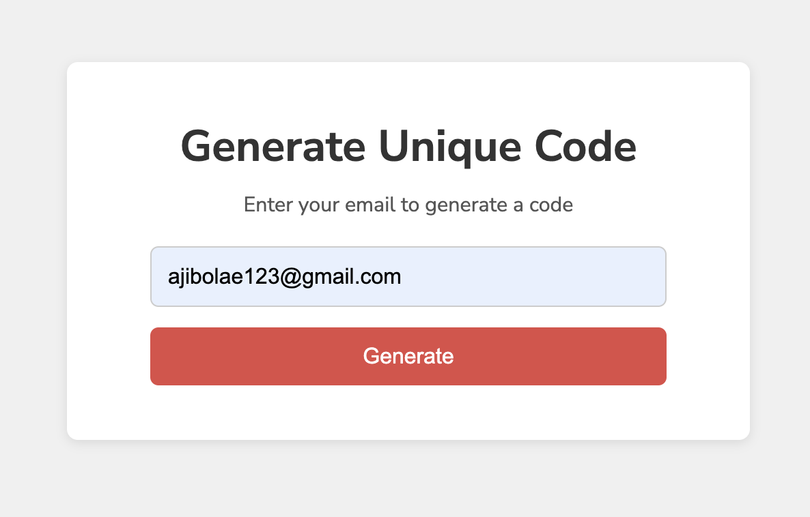
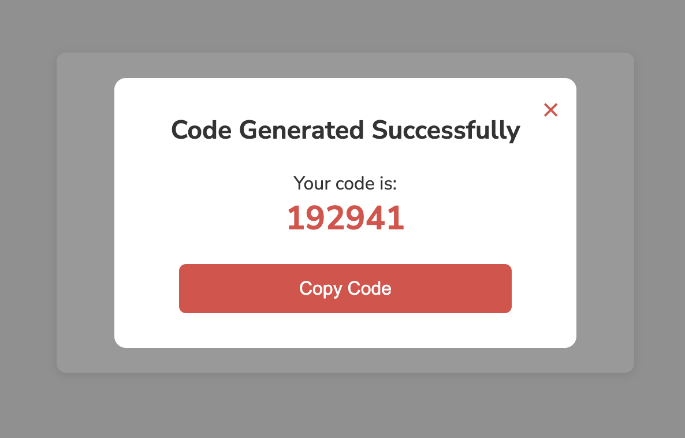

# Unique Code Generator with Modal Popup

A simple web page that lets users enter their email, generate a unique code, and display it in a centered modal popup. The code can also be copied to the clipboard.

## Features
- Responsive form
- Random 6-digit code generator
- Centered modal overlay with dimmed background
- Copy to clipboard
- Close the modal by clicking X or the background

## Files
- `index.html` – Main structure
- `style.css` – Styling for form and modal
- `index.js` – JavaScript logic for code generation and modal handling

## Prompt Box Preview

## Modal Box Preview

## Demo
https://modal-popup-iota.vercel.app/
